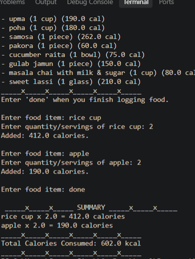
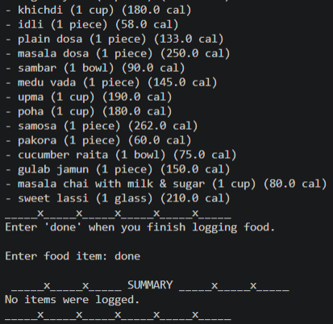
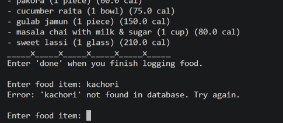

# Calorie Calculator

A simple tool to help you count your daily calories from common foods and everyday Indian meals.

## What is this project?
This is a small program that runs right in your terminal. You tell it what you ate and how much, and it looks up the calories, does the math for you, and gives you a neat summary of your total intake at the end.

## What it can do?
* Shows you a built-in list of foods with their calorie values.
* Lets you enter multiple items and serving sizes one by one.
* Immediately tells you how many calories were added after each item.
* Gives you a clean final calculation of everything you ate and your grand total calories.

## Tools Used:
* Python 3 (runs purely on basic Python, no extra installations needed).

## How to Set It Up and Run It?
1. Make sure Python is installed on your computer.
2. Put the code in a file called `calorie_calculator.py`.
3. Open your terminal or command prompt and go to the folder where your file is saved.
4. Type this command and press Enter:
   python calorie_calculator.py

## How to Test It?
To make sure everything is working properly:
1. Try typing `apple` and enter `2` when it asks for the quantity. You should see 190 calories added.
2. Try typing `samosa (1 piece)` with a quantity of `1`. It should add 262 calories.
3. Try typing a food not on the list (like `pizza`). It should tell you the item was not found and let you try again.
4. Type `done`. The program should print your final list with the correct total.

## Screnshots

  